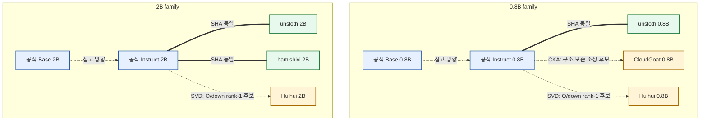

# Qwen3.5 모델 가중치 계보 분석

## 10분 발표 운영표

| 슬라이드 | 주제 | 시간 |
|---:|---|---:|
| 1 | 결론 먼저 | 0:40 |
| 2 | 무엇을 분석했나 | 0:50 |
| 3 | 다섯 가지 측정 도구 | 1:30 |
| 4 | 알고리즘 작동 과정 | 1:10 |
| 5 | MotherTree 전체 계보도 | 2:00 |
| 6 | CloudGoat 결과 | 1:10 |
| 7 | Huihui 결과 | 1:10 |
| 8 | 시사점·한계·다음 단계 | 1:30 |
| 합계 | 질의 전 본 발표 | 10:00 |

---

## 슬라이드 1. 결론 먼저

### 화면에 표시

**10개 저장소 이름, 실질적으로는 7개 고유 weight**

- 3개: 공식 Instruct와 byte 단위 완전 동일
- CloudGoat: 구조를 유지하며 언어 core를 넓게 조정한 후보
- Huihui 0.8B/2B: O/down만 사실상 rank-1로 바꾼 후보
- 결과물: 가중치 증거 기반 MotherTree 후보도

### 발표자 노트

“모델이 어떤 답을 하는지는 실행하지 않았습니다. 모델 내부의 수십억 개 숫자를
직접 비교했습니다. 가장 놀라운 결과는 서로 다른 이름의 세 모델이 공식 Instruct와
파일 전체가 같았고, 나머지 변형은 서로 전혀 다른 방식으로 weight를 바꿨다는 점입니다.”

---

## 슬라이드 2. 무엇을 분석했나

### 화면에 표시

| 구분 | 0.8B | 2B |
|---|---:|---:|
| 모델 수 | 5 | 5 |
| 공식 기준점 | Base, Instruct | Base, Instruct |
| 외부 후보 | unsloth, CloudGoat, Huihui | unsloth, hamishivi, Huihui |

- 실제 safetensors 약 `29.35GB`
- Tensor 통계 `5,600행`, 오류 `0`
- 비교 계산은 NAS CPU/RAM 사용

**10개를 버린 것이 아니라, 동일 weight를 묶어 7개만 반복 비교**

```text
0.8B: 5개 - 중복 1개 = 고유 4개
2B:   5개 - 중복 2개 = 고유 3개
합계: 10개 배포본 = 고유 weight 7개
```

### 발표자 노트

“0.8B와 2B는 크기와 matrix shape가 달라 서로 직접 빼지 않았습니다. 10개 중
세 모델을 제외한 것도 아닙니다. 0.8B의 unsloth는 공식 Instruct와 같아 중복 1개,
2B의 unsloth와 hamishivi도 공식 Instruct와 같아 중복 2개입니다. 그래서 10개
배포본을 모두 계보에 표시하되 실제 거리 계산은 고유 weight 7개로 수행했습니다.”

---

## 슬라이드 3. 다섯 가지 측정 도구

### 화면에 표시

| 도구 | 쉬운 뜻 | 답하는 질문 |
|---|---|---|
| SHA-256 | 파일 주민등록번호 | 완전히 같은가? |
| Weight distance | 다이얼 이동량 | 얼마나 바뀌었나? |
| Kurtosis | 숫자 분포의 꼬리 모양 | 변화의 통계 형태가 다른가? |
| CKA | 내부 관계 구조 유사도 | 바뀌어도 geometry는 유지됐나? |
| Delta SVD | 변화를 주요 방향으로 분해 | 한 방향 변환인가? |

```text
Weight distance = ||A-B|| / 두 weight의 원래 크기
Delta = 후보 weight - 기준 weight
```

### 발표자 노트

“거리 하나로 모든 것을 판단하지 않았습니다. Weight distance는 숫자의 이동량,
kurtosis는 분포 모양, CKA는 내부 배치 관계를 봅니다. SVD는 변화 자체를 분해해서
한 개 방향으로 설명되는지 확인합니다. 예를 들어 학생들의 키가 모두 바뀌어도 순서와
관계가 유지되면 CKA는 높습니다.”

“Q/K/V/O는 attention의 찾기·표지·내용·출력 행렬이고, MLP는 정보를 확장하고 다시
압축하는 블록입니다. Q/K만 보면 O/down만 바뀐 변형은 놓칠 수 있습니다.”

---

## 슬라이드 4. 알고리즘은 이렇게 작동했다

### 화면에 표시


1. 전체 모델과 language core를 따로 계산
2. Weight distance로 가까운 edge 탐색
3. CKA/SVD로 edge의 변화 유형 설명
4. 확정 관계와 추정 관계를 분리

### 발표자 노트

“Vision이나 embedding이 그대로면 전체 평균에서 언어 변화가 희석됩니다. 그래서
all view와 language-core view를 분리했습니다. 거리로 가장 가까운 후보를 찾고,
CloudGoat처럼 넓게 바뀐 경우 CKA, Huihui처럼 국소적으로 바뀐 경우 SVD를
추가했습니다.”

---

## 슬라이드 5. MotherTree: 현재 계보 후보도

### 화면에 표시



**굵은 선 = 파일 동일 확정 / 점선 = 가중치 기반 파생 후보**

| 10개 전체 분류 | 모델 수 |
|---|---:|
| 공식 Base/Instruct 기준점 | 4 |
| 공식 Instruct exact mirror | 3 |
| Instruct 기반 파생 후보 | 3 |

### 발표자 노트

“초록 그룹은 SHA-256이 같아 이번에 받은 weight 파일 전체가 동일합니다. 노란
후보로 향하는 점선은 거리와 변화 패턴이 Instruct 기원을 강하게 지지하지만 실제
제작 순서를 확정한 것은 아닙니다. Base에서 Instruct로 향하는 선도 이번 weight
분석만으로 시간 방향을 증명한 선이 아니라 공식 기준점과 계열을 표시한 참고선입니다.”

---

## 슬라이드 6. CloudGoat: 넓게 바뀌었지만 구조는 유지

### 화면에 표시

- Instruct 최근접
- Language-core 거리: `0.042149`
- Base→Instruct 거리의 `89.12%`
- Core 192개 중 `96개` 변경
- Q/K/V/O 일부 + MLP gate/up/down 전반 변경
- 변경 tensor CKA 모두 `0.991 이상`
- 가장 큰 변화: `MLP-up`

**분류: geometry-preserving substantial core fine-tune 후보**

### 발표자 노트

“CloudGoat는 가벼운 몇 군데 수정이 아닙니다. 언어 core 변화 규모가 Base와
Instruct 사이 거리의 약 89%입니다. 하지만 CKA가 모두 0.991 이상이어서 숫자가
많이 움직였어도 기존 matrix의 관계 구조는 유지됐습니다. 이름에 JP-Tuned가 있지만
일본어 성능은 이번 분석으로 검증하지 않았습니다.”

---

## 슬라이드 7. Huihui: 한 방향으로 찍힌 변환 도장

### 화면에 표시

- Instruct 최근접
- 0.8B core 거리 비율: `24.38%`
- 2B core 거리 비율: `16.55%`
- 변경 위치: Attention O + MLP down
- 변경 tensor `100/100` 모두 사실상 rank-1
- 첫 방향의 설명력: 최소 `99.46%`
- Base→Instruct 변화 방향과 거의 직교

**분류: targeted rank-1 projection transformation 후보**

### 발표자 노트

“도시 전체 이동이 사실상 화살표 하나로 설명되는 것과 같습니다. 0.8B와 2B에서
똑같이 O와 down에만 이런 패턴이 반복됐습니다. 그래서 모델 전체를 다시 학습한
모습보다 공통된 표적 변환 절차의 fingerprint에 가깝습니다. 다만 rank-1이라고
LoRA 사용을 확정할 수 없고, abliterated 기능 효과도 행동 평가가 필요합니다.”

---

## 슬라이드 8. 우리가 얻은 것과 아직 모르는 것

### 화면에 표시

#### 얻은 것

1. 저장소 10개 → 고유 weight 7개
2. 복제본, 광범위 조정, 표적 변환을 구분
3. Q/K-only 분석의 사각지대 발견: O/down 필수
4. 거리=edge 비용, CKA/SVD=edge 유형이라는 구조 확립

#### 아직 모르는 것

- 실제 제작 시간 순서와 학습 데이터
- `JP-Tuned`, `abliterated`의 행동 효과
- 법적 출처·라이선스 판단

#### 다음 단계

외부 provenance 결합 → directed MotherTree 확정도 향상 → 행동 평가

### 발표자 노트

“현재 MotherTree는 기술적으로 강한 계보 후보도입니다. 다음에는 공개 시점과
base-model 선언을 붙여 점선 방향을 보강하고, 모델 응답 평가를 별도로 수행해야
합니다. 핵심은 하나의 숫자로 결론 내리지 않고 동일성, 거리, 분포, geometry,
변화 rank를 각각 독립된 증거로 결합했다는 점입니다.”

---

## 발표 후 질문 대응용 한 줄 답변

- **Weight distance가 작으면 부모인가?** 가까운 후보일 뿐, 방향은 별도 증거가 필요합니다.
- **SHA가 같으면 같은 모델인가?** 이번 safetensors weight는 byte 단위로 같습니다.
- **CKA 0.99면 거의 안 바뀐 건가?** 변화량이 아니라 관계 구조가 유지됐다는 뜻입니다.
- **Rank-1이면 LoRA인가?** 최종 변화가 한 방향이라는 뜻이며 사용 도구는 확정 못 합니다.
- **도용을 증명했나?** 아닙니다. 기술적 동일성·유사성만 분석했습니다.
