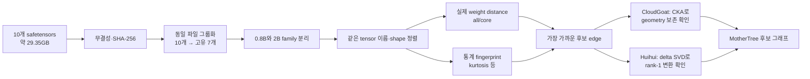
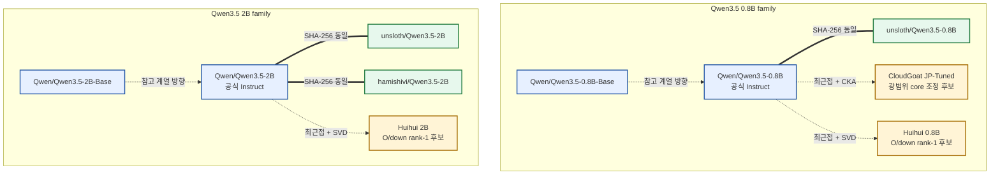
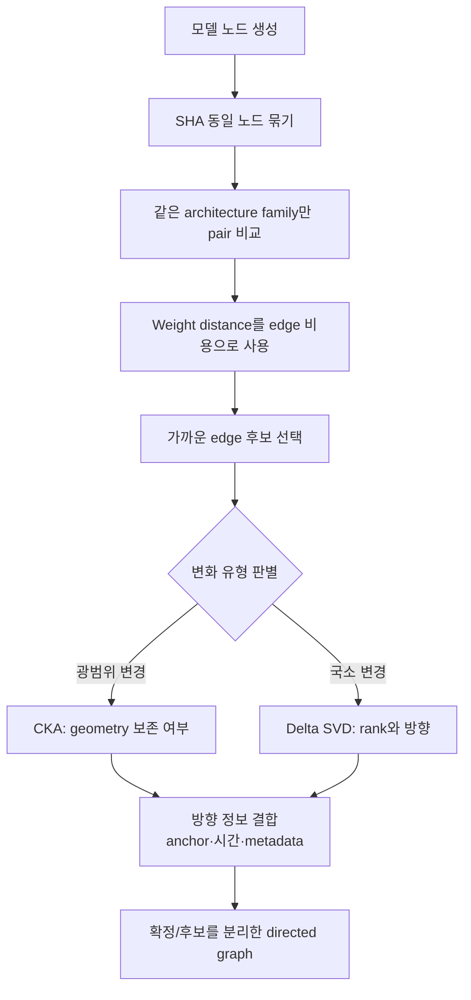

# Qwen3.5 10개 모델 계보 분석: 팀 공유 보고서

## 1. 한 문장 결론

서로 다른 이름으로 배포된 Qwen3.5 모델 10개를 실제 가중치로 비교한 결과,
3개는 공식 Instruct와 byte 단위로 완전히 같은 복제본이었고, CloudGoat는
Instruct 구조를 유지한 광범위 조정 후보, Huihui 2개는 Instruct의 특정 출력
행렬만 사실상 rank-1로 바꾼 표적 변환 후보였다.

> 중요한 한계: 이 결과는 `가중치 관계`를 보여준다. 실제 제작 시점, 사용한
> 데이터, 제작자의 의도까지 가중치만으로 증명하지는 않는다.

## 2. 왜 이 분석을 했는가

Hugging Face 같은 모델 저장소에서는 같은 모델이 다른 이름으로 다시 올라오거나,
원본을 조금만 수정한 모델이 별도 모델처럼 배포될 수 있다. 저장소 이름과 설명만
읽어서는 다음을 구분하기 어렵다.

- 원본과 완전히 동일한 복제본인가?
- 같은 계열이지만 실제로 학습을 더 한 모델인가?
- 일부 기능만 겨냥해 특정 가중치만 바꾼 모델인가?
- 우연히 통계가 비슷할 뿐 관계가 없는 모델인가?

그래서 모델이 내놓는 문장 대신, 모델 내부에 저장된 숫자 자체를 비교했다.

## 3. 먼저 알아야 할 최소 용어

### 3.1 LLM과 weight

LLM은 입력 문장에서 다음에 올 말을 계산하는 매우 큰 수학 함수다. `weight`는
그 함수 안에 저장된 수십억 개의 숫자다. 사람의 기억을 직접 저장한 문장 목록이라기보다,
학습하면서 조정된 수많은 다이얼 값에 가깝다.

### 3.2 Tensor와 matrix

- `tensor`: weight 숫자를 여러 차원으로 묶은 배열
- `matrix`: 행과 열로 된 2차원 tensor
- `layer`: 여러 tensor가 모여 한 단계의 계산을 수행하는 단위

비유하면 모델은 24층 공장이고, 각 layer는 한 층, tensor는 그 층에 설치된
기계의 설정표다. 두 모델의 같은 층·같은 기계 설정표를 맞춰 비교했다.

### 3.3 safetensors

이번에 분석한 실제 모델 weight 파일 형식이다. 실행 코드가 아니라 tensor 이름,
shape, dtype, 실제 숫자를 안전하게 저장하는 컨테이너다. 분석기는 한 번에 모델
전체를 RAM에 올리지 않고 필요한 tensor를 순서대로 읽었다.

### 3.4 Base와 Instruct

- `Base`: 일반적인 다음 토큰 예측 중심으로 학습된 기반 모델
- `Instruct`: 질문과 지시를 더 잘 따르도록 후속 학습된 모델

이번 분석에서는 Qwen 공식 Base와 공식 Instruct를 비교 기준점(anchor)으로 사용했다.

### 3.5 Q/K/V/O와 MLP

Attention은 문장 안에서 어떤 정보에 주목하고 전달할지 계산한다.

- `Q(Query)`: 지금 무엇을 찾는가
- `K(Key)`: 각 정보가 어떤 표지를 가졌는가
- `V(Value)`: 실제로 전달할 내용은 무엇인가
- `O(Output)`: 모은 정보를 layer 밖으로 어떤 형태로 내보내는가

`MLP`는 attention 뒤에서 정보를 변환하는 계산 블록이다.

- `gate/up`: 어떤 특징을 얼마나 확장할지 결정
- `down`: 확장된 정보를 원래 hidden 크기로 다시 압축

따라서 Q/K만 보면 정보 탐색 방식은 볼 수 있지만, O/down만 바꾼 변환은 놓칠 수 있다.

## 4. 기술 지표를 쉬운 말로 설명하면

### 4.1 SHA-256: 파일 전체의 주민등록번호

파일의 모든 byte를 하나의 긴 식별값으로 만든다. SHA-256이 같으면 이번에 받은
파일은 통계적으로 비슷한 정도가 아니라 byte 단위로 완전히 같다.

역할: 비싼 분석 전에 완전 복제본을 제거한다.

### 4.2 Weight distance: 같은 위치의 다이얼이 얼마나 움직였는가

같은 이름과 shape의 두 weight matrix `A`, `B`를 직접 뺀 뒤 전체 변화량을 잰다.

```text
symmetric L2 = ||A - B||F / sqrt(||A||F² + ||B||F²)
```

- `||A-B||F`: 대응하는 모든 숫자의 차이를 합친 크기
- 분모: 모델마다 원래 weight 크기가 다른 영향을 줄이는 정규화
- `0`: 두 tensor가 동일
- 값이 클수록: 대응 위치의 숫자가 더 많이 이동

비유하면 두 사람의 얼굴 사진에서 같은 좌표의 픽셀을 하나씩 빼서 전체 차이를
재는 방법이다. 가장 가까운 모델 후보를 고르는 `거리 자`로 사용했다.

### 4.3 Cosine distance: 크기보다 방향이 같은가

두 weight 배열을 긴 화살표로 보았을 때 방향이 얼마나 다른지 측정한다.
숫자 크기가 조금 달라도 패턴의 방향이 같으면 작게 나온다. L2와 함께 보면
단순 크기 변화와 방향 변화를 구분하는 데 도움이 된다.

### 4.4 Kurtosis: 숫자 분포의 꼬리가 얼마나 뾰족한가

Weight 값 대부분이 중앙에 모이고 극단값이 얼마나 자주 나타나는지를 나타내는
분포 통계다. 평균이 같은 두 모델도 극단적인 weight가 늘어나면 kurtosis가 달라진다.

비유하면 두 자루의 자갈 무게 평균은 같아도, 한 자루에 유난히 무거운 돌 몇 개가
섞였는지 확인하는 지표다.

역할: 값이 `얼마나` 움직였는지를 재는 L2와 달리, weight 분포의 `모양`이
달라졌는지 확인한다. 다만 일부 tensor만 바뀌면 전체 중앙값에서는 변화가 숨을 수
있으므로 tensor별 p95와 변경 개수를 함께 봐야 한다.

### 4.5 CKA: 내부 구조의 배치 관계가 유지됐는가

CKA(Centered Kernel Alignment)는 두 matrix가 만드는 행·특징 사이의 관계 구조가
얼마나 비슷한지를 `0~1`에 가까운 값으로 측정한다.

- `1에 가까움`: 숫자는 바뀌었어도 전체 관계 구조는 거의 유지
- `낮아짐`: 내부 geometry, 즉 특징의 배치 관계도 달라짐

비유하면 학생들의 키가 모두 조금 변했더라도 키 순서와 학생 간 차이 관계가
그대로면 CKA는 높다. 이번에는 큰 matrix에서 최대 2,048행을 같은 규칙으로 뽑아
linear CKA를 계산했다.

### 4.6 Delta: 원본에서 후보로 가는 변화량

```text
Delta = 후보 weight - 기준 weight
```

Weight 자체가 아니라 무엇을 더하거나 뺐는지 분리한 값이다. 계보 분석에서는
`Base→Instruct` 변화와 `Instruct→후보` 변화가 같은 방향인지 비교할 수 있다.

### 4.7 SVD와 rank-1: 복잡한 변화가 몇 개 방향으로 설명되는가

SVD(Singular Value Decomposition)는 하나의 matrix 변화를 중요한 방향 순서로
분해한다.

- 첫 방향 하나가 대부분을 설명: `rank-1에 가까운 변화`
- 여러 방향이 필요: 복잡하고 분산된 변화

비유하면 도시 전체의 이동을 분석했는데 거의 모든 사람이 같은 한 방향으로만
움직였다면 하나의 화살표로 설명할 수 있다. Huihui에서는 변경된 모든 matrix의
변화 에너지 99.46% 이상을 첫 방향 하나가 설명했다.

### 4.8 Update alignment: 두 학습 방향이 같은가

`Base→Instruct delta`와 `Instruct→후보 delta`를 화살표로 보고 cosine을 계산했다.

- `+1`: 거의 같은 방향
- `-1`: 거의 반대 방향
- `0`: 거의 직교해 서로 다른 방향

Huihui의 alignment는 거의 0이었다. 즉 Base를 Instruct로 만든 변화를 더 이어간
것도, 단순히 되돌린 것도 아닌 별도 방향의 표적 변화로 해석된다.

## 5. 실제 알고리즘은 어떻게 작동했는가



세부 절차는 다음과 같다.

1. 10개 파일의 tensor 수, parameter 수, SHA-256을 확인했다.
2. SHA-256 동일 모델을 한 그룹으로 묶어 실질 비교 대상을 7개로 줄였다.
3. 크기가 다른 0.8B와 2B는 직접 비교하지 않고 각각의 family 안에서만 비교했다.
4. 정확히 같은 tensor 이름·shape·dtype끼리 정렬해 원소를 비교했다.
5. 전체 모델(`all`)과 언어 핵심 layer(`language_core`)를 분리했다. Vision이나
   embedding의 불변 영역이 언어 변화량을 희석하지 않도록 하기 위해서다.
6. 7개 고유 모델의 family 내부 9개 pair에서 L2, cosine, kurtosis를 계산했다.
7. 광범위하게 변한 CloudGoat는 CKA로 원래 geometry 보존 여부를 확인했다.
8. 특정 projection만 변한 Huihui는 delta SVD와 update alignment로 변화의 rank와
   방향을 확인했다.
9. Weight distance를 edge 비용으로, CKA/SVD를 edge 유형으로 사용해 계보 후보를
   정리했다.

## 6. 분석 규모와 무결성

| 항목 | 결과 |
|---|---:|
| 입력 모델 | 10개: 0.8B 5개 + 2B 5개 |
| 입력 weight 크기 | 약 29.35GB |
| Tensor 통계 | 5,600행, 오류 0 |
| SHA 제거 후 고유 모델 | 7개 |
| Family 내부 pair | 9개 |
| Weight-distance tensor pair | 4,824행 |
| Shape/dtype skip | 0/0 |
| CloudGoat CKA | 96행 |
| Huihui delta SVD | 100행 |
| NAS 회귀 테스트 | 13개 통과 |
| 고급 분석 재현성 | 같은 seed 재실행 결과 일치 |

통계 분석과 거리 분석은 NAS CPU/RAM에서 실행했다. 로컬 PC에는 결과 문서와
JSON/JSONL을 동기화했다.

## 7. 10개 모델 결과

### 7.1 왜 10개가 7개가 됐는가

`10개`는 다운로드한 모델 저장소·파일의 수이고, `7개`는 서로 다른 weight 내용의
수다. 분석 대상에서 세 모델을 삭제한 것이 아니다. 10개 모두 계보도에 남기되,
SHA-256이 같은 파일을 반복 계산하지 않도록 pairwise 분석에서 하나의 대표 weight로
묶었다.

| Family | 다운로드한 5개 | SHA 동일 그룹 | 고유 weight 계산 |
|---|---|---|---:|
| 0.8B | Base, Instruct, unsloth, CloudGoat, Huihui | Instruct = unsloth | 5 - 1 = 4 |
| 2B | Base, Instruct, unsloth, hamishivi, Huihui | Instruct = unsloth = hamishivi | 5 - 2 = 3 |
| 합계 | 배포본 10개 | 중복 weight 3개 | **4 + 3 = 7** |

여기서 0.8B의 동일 그룹은 두 파일이 하나의 고유 weight를 이루므로 중복 1개를
제거한다. 2B의 동일 그룹은 세 파일이 하나의 고유 weight를 이루므로 중복 2개를
제거한다. 따라서 `10 - 1 - 2 = 7`이다.

이 축약에는 두 가지 목적이 있다.

1. 같은 파일끼리 거리 0을 반복 계산하는 비용을 없앤다.
2. 저장소 이름 수가 아니라 실제로 서로 다른 모델 weight 수를 기준으로 계보를 만든다.

다만 SHA 동일성은 `safetensors weight 파일`에 관한 판정이다. 저장소 설명, tokenizer,
라이선스, 배포 주체까지 같다는 의미는 아니다.

### 7.2 SHA-256으로 확정된 동일 파일

| Family | 공식 Instruct와 동일한 모델 | 판정 |
|---|---|---|
| 0.8B | `unsloth/Qwen3.5-0.8B` | 전체 byte 동일 |
| 2B | `unsloth/Qwen3.5-2B` | 전체 byte 동일 |
| 2B | `hamishivi/Qwen3.5-2B` | 전체 byte 동일 |

이 세 관계는 유사도 추정이 아니라 다운로드한 safetensors 파일에 대한 확정적
동일성이다. 다만 저장소의 부가 파일이나 배포 주체까지 같다는 뜻은 아니다.

### 7.3 후보별 핵심 수치

| 후보 | Instruct와 core 거리 | Base→Instruct 거리 대비 | 변경 형태 | 최종 분류 |
|---|---:|---:|---|---|
| CloudGoat 0.8B | 0.042149 | 89.12% | Q/K/V/O 일부 + MLP 전반 | 구조 보존형 광범위 core fine-tune 후보 |
| Huihui 0.8B | 0.011532 | 24.38% | O/down 집중 | 표적 rank-1 projection 변환 후보 |
| Huihui 2B | 0.009362 | 16.55% | O/down 집중 | 표적 rank-1 projection 변환 후보 |

거리의 절대값만 보고 서로 다른 크기 family를 비교하면 안 된다. 여기서는 같은
family의 Base→Instruct 거리를 기준 자로 사용했다.

### 7.4 10개 모델 전체 계보 판정표

| 번호 | 모델 | 기준 모델·그룹 | 관계 판정 | 핵심 증거 | 수준 |
|---:|---|---|---|---|---|
| 1 | `Qwen/Qwen3.5-0.8B-Base` | 0.8B 공식 anchor | Base 기준점 | 공식 Base 파일, Instruct와 core 전반 차이 | 기준점 |
| 2 | `Qwen/Qwen3.5-0.8B` | 0.8B 공식 anchor | Instruct 기준점 | 공식 Instruct 파일 | 기준점 |
| 3 | `unsloth/Qwen3.5-0.8B` | 0.8B Instruct 동일 그룹 | Exact mirror | SHA-256 전체 파일 동일 | 확정 |
| 4 | `CloudGoat/Qwen3.5-0.8B-JP-Tuned-v1.0` | 0.8B Instruct | 구조 보존형 광범위 core fine-tune 후보 | 최근접, core 96개 변경, CKA 0.991 이상 | 강한 후보 |
| 5 | `huihui-ai/Huihui-Qwen3.5-0.8B-abliterated` | 0.8B Instruct | 표적 rank-1 projection 변환 후보 | 최근접, O/down 집중, top-1 energy 99.71% 이상 | 강한 후보 |
| 6 | `Qwen/Qwen3.5-2B-Base` | 2B 공식 anchor | Base 기준점 | 공식 Base 파일, Instruct와 core 전반 차이 | 기준점 |
| 7 | `Qwen/Qwen3.5-2B` | 2B 공식 anchor | Instruct 기준점 | 공식 Instruct 파일 | 기준점 |
| 8 | `unsloth/Qwen3.5-2B` | 2B Instruct 동일 그룹 | Exact mirror | SHA-256 전체 파일 동일 | 확정 |
| 9 | `hamishivi/Qwen3.5-2B` | 2B Instruct 동일 그룹 | Exact mirror | SHA-256 전체 파일 동일 | 확정 |
| 10 | `huihui-ai/Huihui-Qwen3.5-2B-abliterated` | 2B Instruct | 표적 rank-1 projection 변환 후보 | 최근접, O/down 집중, top-1 energy 99.46% 이상 | 강한 후보 |

현재 10개 전체에 대해 `공식 기준점 4개`, `exact mirror 3개`, `파생 후보 3개`로
관계를 정리할 수 있다. 단, Base→Instruct와 Instruct→파생 후보의 시간 방향은 외부
provenance를 결합하기 전까지 후보 방향이다.

## 8. CloudGoat 해석

CloudGoat는 0.8B Instruct에 가장 가깝지만 언어 핵심 영역의 변화량이 작지는 않다.

- Core 192개 tensor 중 96개 변경
- Q/K/V와 full-attention layer의 O 변경
- 24개 layer의 MLP gate/up/down 변경
- 가장 큰 weight 변화: `MLP-up`
- 모든 변경 matrix CKA: `0.991 이상`
- MLP-up CKA 중앙값: `0.992794`
- CKA distance와 L2 상관: `0.92799`

즉 많은 다이얼을 움직였지만 원래 matrix의 관계 구조는 크게 무너지지 않았다.
따라서 현재 증거에 가장 잘 맞는 표현은 다음과 같다.

`Instruct-nearest, geometry-preserving substantial core fine-tune candidate`

저장소 이름 때문에 일본어 성능 향상을 가정할 수는 있지만, 실제 일본어 데이터나
성능 효과는 이번 weight 분석 범위 밖이다.

## 9. Huihui 해석

0.8B와 2B 모두 거의 같은 위치와 같은 형태로 변했다.

- Q/K/V, gate/up, norm은 language core에서 거리 0
- Attention output(`O`)과 MLP down projection만 집중 변경
- 고급 분석 대상 100개 변경 tensor 모두 사실상 rank-1
- Top-1 energy 최솟값: `99.46%`
- 0.8B top-1 energy 평균: `99.7684%`
- 2B top-1 energy 평균: `99.5593%`
- Base→Instruct delta와 alignment: 거의 0

이는 전체를 다시 학습해 많은 방향으로 바꾼 모습보다, 특정 projection에 매우
일관된 단일 방향 변환을 적용한 모습에 가깝다. 0.8B와 2B에서 같은 패턴이 반복되므로
변환 방식 자체가 강한 fingerprint가 된다.

현재 증거에 맞는 표현은 다음과 같다.

`Instruct-nearest, targeted rank-1 projection transformation candidate`

`abliterated`라는 이름이 기능적 목적을 암시하지만, 실제 거부 행동 제거 여부는
별도의 프롬프트 행동 평가 없이는 확정할 수 없다.

## 10. MotherTree: 10개 모델 계보 후보도

### 10.1 읽는 법

- 굵은 실선/동일 그룹: SHA-256으로 확정된 동일 weight
- 점선 화살표: weight 증거가 지지하는 파생 관계 후보
- Base→Instruct 점선: 공식 anchor와 거리로 둔 참고 방향이며, 이번 weight 분석만으로
  실제 학습 시간 순서를 증명한 것은 아님



### 10.2 MotherTree를 만드는 원리



일반적인 tree 복원에서는 가까운 모델끼리 연결하되 cycle을 막고 전체 연결 비용이
작은 구조를 찾을 수 있다. 그러나 거리 자체는 방향이 없다. `누가 부모인가`를
말하려면 공개 시점, 공식 base-model 선언, 학습 기록 같은 외부 provenance가 필요하다.
그래서 현재 도식은 방향을 확정한 족보가 아니라 증거 수준을 표시한 후보 그래프다.

## 11. 이번 분석에서 얻은 핵심 시사점

1. **저장소 수와 실질 모델 수는 다르다.** 10개 중 3개가 공식 Instruct와 완전히
   같아, SHA dedup 후 실질 비교 대상은 7개였다.
2. **전체 평균만 보면 표적 변경을 놓친다.** Huihui는 일부 projection만 변해 전체
   kurtosis 중앙값에서 거의 보이지 않았다.
3. **Q/K만으로는 불충분하다.** CloudGoat 탐지에는 유용했지만 O/down만 바뀐
   Huihui를 찾으려면 V/O와 MLP까지 봐야 한다.
4. **거리와 변화 유형은 다른 질문이다.** Weight distance가 `얼마나 가까운가`를,
   CKA와 SVD가 `어떤 방식으로 바뀌었는가`를 설명한다.
5. **여러 증거 채널을 분리해야 한다.** L2, kurtosis, CKA는 서로 완전히 대체되지
   않는다. 특히 CloudGoat에서 CKA distance와 kurtosis 상관은 `-0.00356`이었다.

## 12. 결론의 증거 수준

| 결론 | 증거 수준 | 이유 |
|---|---|---|
| 3개 배포본이 공식 Instruct weight와 동일 | 확정 | SHA-256 전체 파일 일치 |
| CloudGoat가 0.8B Instruct에 가장 가까움 | 강함 | family 내 weight distance 최소 |
| CloudGoat가 구조 보존형 광범위 조정 | 강함 | 96개 변경 + CKA 0.991 이상 |
| Huihui가 Instruct 최근접 표적 변환 | 강함 | 거리·변경 위치·rank-1 패턴 일치 |
| Huihui 0.8B/2B에 공통 변환 방식 적용 | 강한 후보 | 두 family에서 같은 O/down rank-1 패턴 |
| 점선 화살표가 실제 제작 시간 순서임 | 미확정 | 외부 provenance를 아직 결합하지 않음 |
| 이름에 적힌 기능·언어 성능이 실제 향상됨 | 미확정 | 행동 평가를 하지 않음 |

## 13. 팀원이 기억할 네 문장

1. 이름이 달라도 SHA가 같으면 실제 weight는 같은 모델이다.
2. Weight distance는 변화량, kurtosis는 분포 모양, CKA는 내부 관계 구조를 잰다.
3. SVD는 변화가 한 방향인지 여러 방향인지 보여준다.
4. 현재 MotherTree는 강한 가중치 계보 후보도이지, 제작 이력을 확정한 법적 족보가 아니다.

## 14. 예상 질문과 답변

### Q1. 숫자가 가장 가깝기만 하면 부모 모델인가?

아니다. 거리는 방향이 없다. 최근접 모델은 부모 `후보`가 되지만, 실제 부모 판정에는
공개 시간과 model card, 학습 기록이 필요하다.

### Q2. SHA가 같으면 정말 완전히 같은가?

이번에 다운로드한 safetensors 파일 내용은 같다. 저장소 설명, tokenizer 파일,
라이선스 표기까지 모두 같다는 뜻은 아니다.

### Q3. CKA가 0.99면 거의 수정하지 않았다는 뜻인가?

아니다. 숫자 이동량은 클 수 있지만 관계 geometry가 유지됐다는 뜻이다. CloudGoat는
core 거리 규모가 컸지만 CKA는 높았다.

### Q4. Rank-1이면 LoRA를 사용했다는 뜻인가?

그렇게 확정할 수 없다. 최종 delta가 rank-1에 가깝다는 사실만 확인했다. 어떤 도구나
학습법을 사용했는지는 별도 증거가 필요하다.

### Q5. 이 결과로 모델 도용 여부를 판단할 수 있는가?

아니다. 기술적 동일성·유사성 증거는 제공하지만, 라이선스 준수나 법적 판단은 별도다.

## 15. 다음 단계

1. 공개 시점과 model card의 base-model 선언을 결합해 점선 edge 방향을 보강한다.
2. Huihui rank-1 singular vector를 저장해 layer 간 동일 방향 반복 여부를 측정한다.
3. CloudGoat의 Base→Instruct와 Instruct→CloudGoat delta alignment를 계산한다.
4. 후보 그래프를 JSON/CSV로 저장하는 directed-tree recovery를 구현한다.
5. 실제 프롬프트 행동 평가로 `JP-Tuned`, `abliterated` 기능 가설을 별도 검증한다.

## 16. 근거 자료

- `qwen35_first10_analysis_report.md`: 10개 모델 tensor 통계와 SHA 결과
- `qwen35_weight_distance_report.md`: 7개 고유 모델의 실제 weight distance
- `qwen35_cka_delta_svd_report.md`: CloudGoat CKA와 Huihui delta SVD
- `algorithm_map.md`: 프로젝트의 전체 계보 분석 알고리즘 원칙
